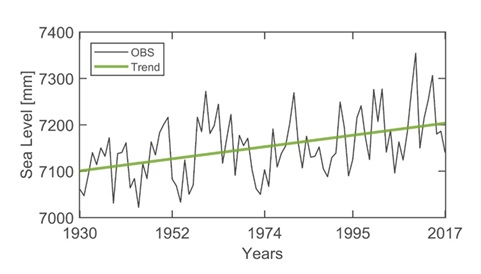

# Introduction
In statistics and data analysis, we begin by observing a process or a phenomenon in nature, e.g., daily rainfall, traffic flow, or displacements, and record it over time, i.e., a time series. To describe the phenomenon observed while preserving the inherent uncertainty, we model the recorded observations via a suitable probability distribution. This will allow us to make statistical statements and inferences, e.g., the probability of observing more than 10 mm of rainfall in a day is 0.5. 

For this representation to be valid, the main underlying assumption is that the observations collected are *independent and identically distributed (i.i.d.)*. In other words, each observation is drawn from the same distribution and does not depend on previous or future values. This assumption holds when the underlying process is *stationary* (a formal definition will follow).

When we assume that the observations are stationary and independent, we can describe them statistically by fitting a (non)-parametric probability distribution to the data and using that model to make inferences about the underlying process.

However, there are many cases in which the assumption of stationarity does not hold. For example,  

  * *Mean temperature*. Evidence of a changing climate has shown that temperature increases as a function of atmospheric CO$_2$ concentration.
  * *Daily rainfall*. In certain geographical regions, precipitation exhibits strong seasonal patterns due to climate cycles.
  * *Traffic flow*. Usually, it shows two prominent peaks each day, in the morning and evening rush hours.

In such cases, the condition of independence between observations is no longer satisfied since a specific moment in time, i.e., a specific season, or a given value of another variable, i.e., $CO_2$ level, can provide insight into sequential observations. Overall,  physical drivers, periodicity, or long-term trends lead to the mean, variance, or higher moments evolving systematically. Hence, assuming stationarity can lead to biased inferences.

Hence, the concept of **nonstationary analysis**: modeling data whose statistical characteristics evolve with time or with an explanatory variable. 

Here, we will explore two different approaches for addressing nonstationarity in the data. In both cases, we assume that the trend observed in the data can be modelled via a deterministic function. e.g., a linear trend over time or as a function of a physical covariate, for which an explicit mathematical formulation is available.

In the first approach, i.e., *detrending approach*, we separate the deterministic and stochastic components and develop a statistical model only for the stochastic component. In the second approach, i.e., *integrated approach*, the deterministic component is incorporated directly into the statistical model. We will apply the latter approach to extreme value analysis and review examples from the scientific literature.

  <strong>Why.</strong> Real-world processes such as rainfall, temperature, or traffic flow often exhibit trends, cycles, or external influences that violate the assumptions of independence and stationarity.  

<strong>What.</strong> A process is nonstationary when its statistical properties, such as mean or variance, change systematically over time or with an explanatory variable.  

<strong>How.</strong> Nonstationary analysis addresses this behavior by allowing model parameters to vary with time or with physical covariates through explicit deterministic functions.

## Data Exploration
A *time series* is a sequence of quantitative observations recorded over time, typically at regular intervals. It can be expressed as $X_t = \{x_1, x_2, \dots, x_N\}$, where $x_t$ denotes the value of a variable observed at time $t$. From a stochastic perspective, a time series can be viewed as a realization of an
underlying random process $\{X_t\}$ with $x_t$ representing the observation at time $t$. A time series, or a collection of such observations, is often referred to as data.

A stochastic process $\{X_t\}$ is said to be **strictly stationary** if
for every integer $k$ and for all time indices $t_1, t_2, \dots, t_k$,
the joint distribution of $(X_{t_1}, X_{t_2}, \dots, X_{t_k})$
is identical to that of $(X_{t_1+h}, X_{t_2+\tau}, \dots, X_{t_k+h})$
for any time shift $h$.
$ P {X_{t_1} \leq c_1,\dots, X_{t_k}\leq c_k} = P {X_{t_1+h} \leq c_1,\dots, X_{t_k+h}\leq c_k}$

A **weak stationary** process refers to a process in which only the mean and covariance are functions of the lag $h$

These observations often reflect an underlying physical process that shapes the structure and dynamics of the series. Hence, we look for a mathematical model that plausibly describes the observations. 

The first step is to visually examine the data in the context of existing knowledge about the processes that generate it. It is conventional to display a sample time series graphically by plotting the values of the random variables on the y-axis with the time scale as the x-axis. It is often helpful to join the points from one time period to the next to get a sense of the continuous pattern behind the data, like a seasonal cycle or a linear trend, Figure 1. 

<figure style="text-align: center;">
  
  <figcaption><strong>Figure 1.</strong> Mean Sea Level and Trend.</figcaption>
</figure>

If prior knowledge exists about the variability of the observations as a function of another variable, e.g., temperature and $CO_2$ in the atmosphere, the two observations can be plotted alongside each other, Figure 2.

<figure style="text-align: center;">
  
  <figcaption><strong>Figure 2.</strong> Mean Global Temperature in response to emissions.</figcaption>
</figure>

**Testing for trend. The Mann-Kenadall Trend Test** A visual inspection provide a first insight into whether trends or patterns exist in the observations collected. However, it is also useful to carry out statistical tests, i.e., test of hypothesis, to evaluate the significance of such trend and patterns observed. Test of hypotesis can be conducted to tests changes in mean values, e.g., such as the Student’s t-test,  or step changes in the average level of the time series, e.g., Pettitt’s test. Similarly, tests can be conducted to detect changes in the variance, e.g., White's tests for heteroschedasticity.

To test whether there is a monotonic trend in the time series, e.g., the observations constatly increase/decrease over time, we can implement the **Mann-Kendall (MK) trend test**. The MK test it is non-parametric, meaning that it does not assume normality or linearity, making it especially useful for environmental data. The hypotheses are:
- *Null hypothesis $H_0$*: There is *no monotonic trend* (data are independent and randomly ordered).
- *Alternative hypothesis $H_1$*: There *is a monotonic trend* (either increasing or decreasing).

Given a time series $X =  x_1, x_2, \dots, x_n $  of length $N$, the statistic $S$ of the test is computed by comparing each observation in a time step with the observations at later time. More specifically

$
S = \sum_{i=1}^{n-1} \sum_{j=i+1}^{n} \operatorname{sgn}(x_j - x_i)
$

where

$
\operatorname{sgn}(x_j - x_i) =
\begin{cases}
+1 & \text{if } x_j - x_i > 0 \\
0 & \text{if } x_j - x_i = 0 \\
-1 & \text{if } x_j - x_i < 0
\end{cases}
$

and variance (assuming that all the observations are unique, i.e., no ties)

$
Var(S) = \frac{n(n-1)(2n+5)}{18}
$

In essence, $S$ counts the number of times the series moves upward versus downward, providing a measure of the overall direction and consistency of a trend.

To carry out the test of significance, the statistic $S$ is standardized as 

$
Z =
\begin{cases}
\dfrac{S - 1}{\sqrt{Var(S)}} & \text{if } S > 0 \\
0 & \text{if } S = 0 \\
\dfrac{S + 1}{\sqrt{Var(S)}} & \text{if } S < 0
\end{cases}
$

where \( Z \) follows approximately a *standard normal distribution* \( N(0,1) \).

Assuming that the level of signicance of the test $\alpha$ is $0.05$, the outcome of the test is the following:

- If $ |Z| > 1.96 $: *Reject $H_0$* there are enough evidence to reject $H_0$ so a significant trend exists.
- If $ |Z| \leq 1.96 $: *Fail to reject $H_1$*, there are no evidence to reject $H_0$ so no significant trend exists.

Here, $1.96$ corresponds to the 97.5th percentile of the standard normal distribution, meaning that there is less than a 0.05 probability of observing a value greater than this under the null hypothesis ($H_0$), essentially the probability of making a Type I error that we are willing to accept. Note that the level of significance is arbitrary and can be chosen depending on the context.

Instead of choosing a fixed level of significance, we can evaluate the *p-value*, which represents the probability of observing the test statistic, in this case $Z$, under the null hypothesis. A small p-value indicates strong evidence against $H_0$, while a large p-value suggests that the observations are consistent with it.

After identifying a trend, a first-order polynomial (linear) fit, often obtained through linear regression, can provide a simple deterministic approximation of the underlying trend.

It is important to note that the MK trend test fails to detect cyclic patterns, such as seasonal variations