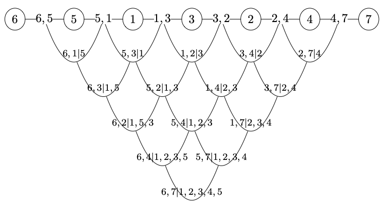
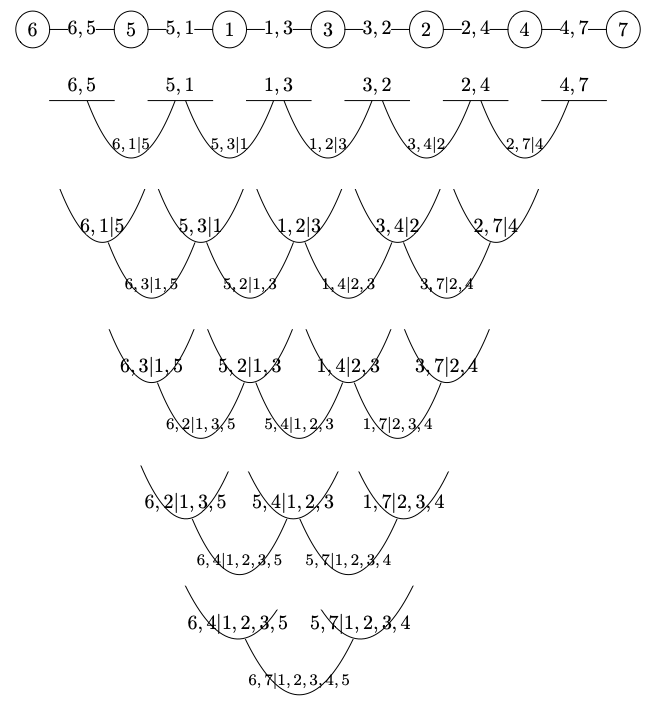

# Definition of regular vines

As stated in Section [Minimal concepts of graph theory](graph_theory), a tree is a connected graph with no cycles. A *vine* is a sequence of trees $T_1,…,T_{n-1}$ such that the edges of $T_i$ become nodes of $T_{i+1}$ for $i=1,…,d-1$. If all edges in $T_i$ connected as nodes in $T_{i+1}$ are adjacent to a common node in $T_i$ then this is a *regular vine*. We call this property the *proximity condition*.  For us, only regular vines will be of interest. Hence, in the following, we will restrict ourselves to this class of vines. {numref}`d-vine-5` presents a regular vine with five nodes. In $T_1$ 3 is adjacent to 4; 4 is adjacent to 3 and 2; 2 is adjacent to 4 and 1; 1 is adjacent to 2 and 5; 5 is adjacent to 1. Thus, 3 has degree 1, 4 has degree 2, 2 has degree 2, 1 has degree 2 and 5 has degree 1. These types of trees are commonly referred to as "*lines*". That is, trees that have two nodes with degree one (*leafs*) and the rest with degree 2. 

```{figure} ./figures/d_vine_5.png
:name: d-vine-5
:width: 500px
---

---
Example of *regular vine* on 5 nodes. Regular vines similar to this are called D-vines (D for drawable).
```

The rest of the tree sequence, that is, $T_2,\ldots,T_4$ is presented in {numref}`tree2` and {numref}`tree3`. Notice that all trees in the sequence are *lines*. For example, the nodes of $T_2$ are $\{3,4\}$, $\{4,2\}$, $\{2,1\}$ and $\{1,5\}$. The edge labeled as $2,3|4$ is incident to the nodes $\{3,4\}$ and $\{4,2\}$; $1,4|2$ is incident to the nodes $\{4,2\}$ and $\{2,1\}$; $2,5|1$ is incident to the nodes $\{2,1\}$ and $\{1,5\}$. Hence,  $\{4,2\}$ and $\{2,1\}$ have degree 2, while  $\{3,4\}$ and $\{1,5\}$ are *leafs* in $T_2$. $T_3$ and $T_4$ follow the same logic as described so far. Regular vines such that, all trees in the sequence are *lines*, are known as D-vines (for drawable vines). On an "opposite" extreme we have C-vine (for canonical). These vines have one node with maximal degree at each tree in the vine. Trees that have one node with maximal degree are often referred to as *stars*. Thus C-vines have a star in each level of the regular vine. 

```{figure} ./figures/tree2.png
:name: tree2
:width: 500px
---

---
$T_2$ for the previous regular vine.
```

```{figure} ./figures/tree3.png
:name: tree3
:width: 500px
---

---
$T_3$ for the previous regular vine.
```


For an edge in a vine, the *constraint set* is the set of nodes that the edge is incident to, and which constrain future edge selection. For example, consider $T_2$. There is one edge incident to $\{3,4\}$ and $\{4,2\}$. Its constraint set consists of these two sets. The *conditioning set* is the intersection of nodes of the constraint sets. Thus, the conditioning set is $\{4\}$ in our example. the conditioned set is the "remaining" part, that is, $\{2,3\}$ in our example. For regular vines, the conditioned set always has two elements. In {numref}`tree2` and {numref}`tree3`, the conditioned set is presented to the left of the vertical line, and the conditioning set to the right. Notice that for $T_1$, the conditioning set is empty. 

## Concept of isomorphism

In later studies, the concept of graph *isomorphism* will be relevant. Two graphs $G$ and $H$ are *isomorphic* if there is a bijection between the node sets of $G$ and $H$; $f:V(G) \rightarrow V(H)$ such that any two nodes $u$ and $v$ of $G$ are adjacent in $G$ if and only if $f(u)$ and $f(v)$ are adjacent in $H$. Loosely speaking, isomorphism in this sense means that if we remove labels and directions from two graph, if the remaining graphs have the same "structure", they are isomorphic. For different regular vines, when $T_1,\ldots,T_{n-1}$ are isomorphic, that is, of the same type or structure, they are *tree-equivalent*. When vines can be transformed into one another by permutation, they are in the same *equivalence class*. 

{numref}`fig_book` presents the 6 equivalence classes of regular vines on 5 nodes. Notice that {numref}`fig_book`(a) corresponds to a D-vine; The regular vines in {numref}`fig_book`(b) and (c) are tree-equivalent but correspond to different equivalence classes, and {numref}`fig_book`(e) is a C-vine. There are 60 D-vines on 5 nodes; 120 regular vines similar to the one in {numref}`fig_book`(f); 60 as in {numref}`fig_book`(b);  120 as in {numref}`fig_book`(c); 60 as in F{numref}`fig_book`(d); and 60 C-vines on 5 nodes. 

```{figure} ./figures/fig_book.png
:name: fig_book
---

---
Examples for the 6 equivalence classes of regular vines on 5 nodes.
```

## Matrix representation

Regular vines are represented through a *vine copula matrix*. A vine copula matrix is an upper-triangular matrix that encodes the structure of a regular vine, specifying the order of variables and the sequence of conditional dependencies in the vine. More formally, let $M$ be an upper triangular matrix with entries $m_{i,j}$ for $i\leq j$. The elements $m_{i,j}$ take values in $\{1,\ldots, d\}$. The matrix $M$ is called a *regular vine matrix* or a *matrix representation of a regular vine*, if it satisfies the following conditions:


1.  $\{m_{1,i},\ldots,m_{i,i}\}\subset\{m_{1,j},\ldots,m_{j,j}\}$  for $1\leq i\le j\leq d$. This means that, the entries of a specific column are also contained in all columns right of this column.

2.  $m_{i,i} \notin \{m_{1,i-1},\ldots,m_{i-1,i-1}\}$. This means that, the diagonal entry of a column does not appear in any column further to the left.
   
3. For $i=3,\ldots,d$ and $k=1,…,i-1$ there exist $(j, l)$ with $j\le i$ and $l \le j$ such that $\{m_{k,i},\{m_{1,i},\ldots,m_{k-1,i}\}\} = \{m_{j,j},\{m_{1,j},\ldots,m_{l,j}\}\}$   or \\$\{m_{k,i},\{m_{1,i},\ldots,m_{k-1,i}\}\}=\{m_{l,j},\{m_{1,j},\ldots,m_{l-1,j},m_{j,j}\}\}$. This last statement means that the elements of $M$ should comply with the proximity condition for regular vines. 

The diagonal elements $m_{i,i}$ represent the variables in a particular order while upper-diagonal elements $m_{i,j} ,(i\leq j)$ determine the conditioning and conditioned sets of the pair copulas in the vine.

For example, matrix $M$ below is a regular vine matrix for the regular vine in {numref}`fig_book`(b). Where, $(m_{2,2},m_{1,2} )=(4,5)$; $(m_{3,3},m_{1,3} )=(2,4)$; $(m_{4,4},m_{1,4})=(1,2)$ and $(m_{5,5},m_{1,5} )=(3,4)$ represent $T_1$. $(m_{3,3},m_{2,3} |m_{1,3} )=(2,5|4)$; $(m_{4,4},m_{2,4} |m_{1,4} )=(1,4|2)$; and  $(m_{5,5},m_{2,5} |m_{1,5} )=(3,2|4)$ represent $T_2$. $(m_{4,4},m_{3,4} |m_{2,4},m_{1,4} )=(1,5|4,2)$ and $(m_{5,5},m_{3,5} |m_{2,5},m_{1,5} )=(3,1|2,4)$ constitute $T_3$ and $T_4$ has as single edge $(m_{5,5},m_{4,5} |m_{3,5},m_{2,5},m_{1,5} )=(3,5|1,2,4)$.

$M =
\begin{bmatrix}
5 & 5 & 4 & 2 & 4 \\
  & 4 & 5 & 4 & 2 \\
  &   & 2 & 5 & 1 \\
  &   &   & 1 & 5 \\
  &   &   &   & 3 \\
\end{bmatrix}
$

## It's your turn now!

Draw the regular vine (and its decomposition in trees) corresponding to the following matrix.

$M =
\begin{bmatrix}
2 & 2 & 3 & 1 & 2 & 4 & 5 \\
  & 3 & 2 & 3 & 3 & 2 & 1 \\
  &   & 1 & 2 & 1 & 3 & 3 \\
  &   &   & 5 & 5 & 1 & 2 \\
  &   &   &   & 4 & 5 & 4 \\
  &   &   &   &  & 7 & 7 \\
  &   &   &   &  &  & 6 \\
\end{bmatrix}
$

```{admonition} Solution
:class: tip, dropdown

The regular vine corresponding to the above matrix is:



and it is composed of the following trees:



```

.