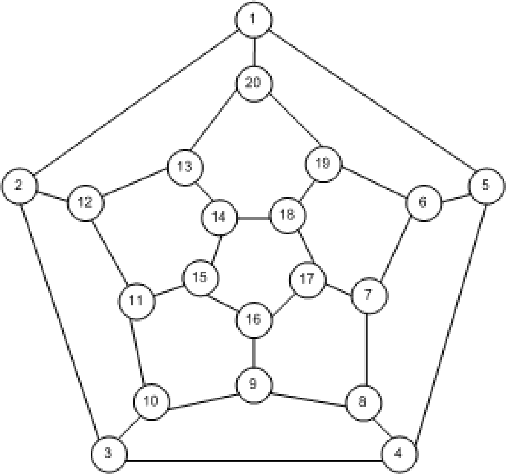
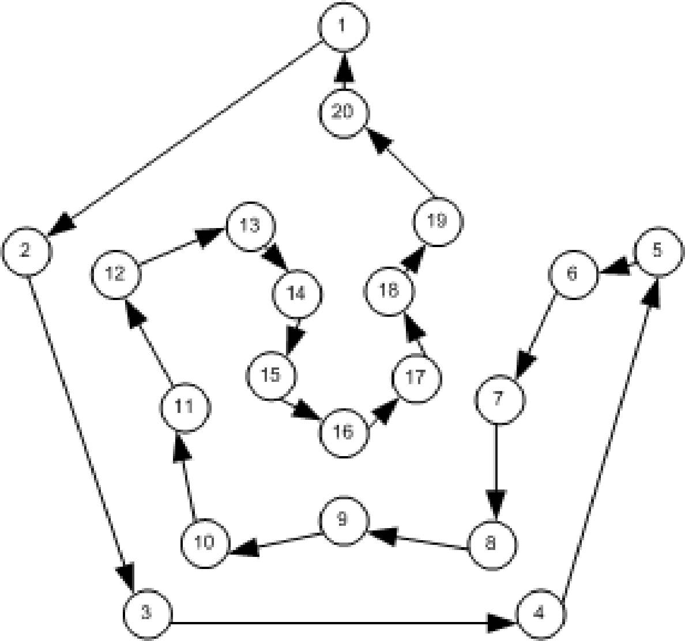

(graph_theory)=

# Minimal concepts of graph theory

Vines and Bayesian Networks (BNs) combine graph theory with probability theory. For this reason we introduce minimal concepts of graph theory. 

Because of his discussion of a famous problem called the
Konigsberg bridge problem, Leonhard Euler is acknowledged as the
father of graph theory. This problem appears in almost any modern
text book on graph theory. Euler's original paper is written in
Latin, for a translation to English the reader is referred to Biggs et al. (1986)[^1]. Like
many problems in probability theory, some of the early developments
of graph theory originated from games. One of these was the
hamiltonian game invented by Sir William Hamilton. The hamiltonian
game will be used to introduce some definitions and notation that
will be used later in the rest of the thesis.

An *undirected graph* $G = (N,E)$ consists of a finite non empty set $N$ of nodes, also called (points or vertices) and a possibly empty set $E$ of edges (lines or arcs) where each element is an unordered pair $(\alpha_1,\alpha_2)$, where $\alpha_1$ and $\alpha_2 \neq \alpha_1$ are elements of $N$. Without loss of generality,  when $N =\{1,2,...,n\}$ we speak of *labeled graphs*. It will be  assumed that two distinct edges do not join the same pair of nodes.  Graphs in which this is allowed are called *multigraphs*. Observe that no self-loops are permitted that is, edges joining nodes with itself. If the pair $(\alpha_1,\alpha_2)$ is ordered then $G$ is a *directed graph* and the pair $(\alpha_1,\alpha_2)$ will be represented as $\alpha_1 \rightarrow \alpha_2$. In this case $\alpha_1$ will be called a *parent* node of the *child* node $\alpha_2$. Examples of undirected and directed graphs are shown in the Figures below.

<em>Figure 1. Examples of graphs: (left) undirected, and (right) directed.</em>

The cardinality of $N$ is called the *order* of the graph. If
the pair $(\alpha_1,\alpha_2) \in E$ then the two nodes $\alpha_1$
and $\alpha_2$ are *adjacent* and each one is
*incident* with the pair $(\alpha_1,\alpha_2) \in E$. The *degree* of a node is the number of edges incident with it. A
*complete graph*  $CG$ has every node adjacent to each other.
A *path* of length $n$ from $\alpha$ to $\beta$ is a sequence
$\alpha= \alpha_0, . . . , \alpha_n = \beta$  of distinct nodes such
that $(\alpha_{i-1}, \alpha_{i}) \in E$ for all $i = 1, . . . , n$.
A *cycle* is a path such that $\alpha = \beta$. If every pair
$(\alpha_{i-1}, \alpha_{i})$ in a cycle of a directed graph is
ordered as in $E$ then it is a *directed cycle* otherwise it
is an *undirected cycle*. If a directed graph has no directed
cycles, then it is a *directed acyclic graph* (DAG).

Hamilton proposed a graph like the one in Figure 1
where each node represented a city of the world and the edges
connections between the cities. The object of the game was to travel
"Around the World" by finding a route that passes through each node
exactly once. In other words, the object of the game was to find a
cycle of the graph in Figure 1 such that all nodes in
$N$ are contained in the cycle. One possible such cycle is
represented by the directed graph in Figure 1(right).
According to Harary (1967)[^2] "Hamilton sold
this idea to a game manufacturer in Dublin  for about twenty-five
guineas which was wise of him since it was not a commercial success".[^3]

Since the introduction of graphs by Euler, its applications to many
fields of science has grown. Probability theory has also relied on graphs to advance its methods. Two types of graphs will be of special importance in this course: directed acyclic graphs and trees. A *tree* is a graph without cycles. Notice that trees can be directed or non-directed. 

[^1]: Biggs, N. and Lloyd, E. K. and Wilson, R. J. (1986). Graph Theory: 1736-1936. Clarendon Press, New York, NY, USA. ISBN: 0-198-53916-9.

[^2]: Harary, F. (1967). Some theorems and concepts of graph theory, in: F. Harary (Ed.), A Seminar on Graph Theory, 1967, pp. 1-12.

[^3]: One guinea in Victorian Britain was equivalent with 26.25
pounds.